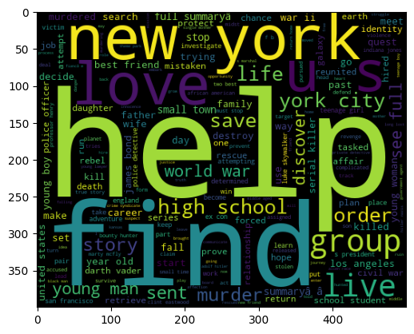

# Python期中大作业——MovieLens电影数据分析

## Task 1 性别偏好分析

选择观影人数超过300，且平均得分超过3.5的电影数据进行分析。

**Figure 1.1** 观影情况。柱状图高度表示看过该电影的该性别人数，取前二十名表示男/女性偏好电影。


**Figure 1.2** 类别偏好。左边的两幅图表示男/女性观看某种类型的电影的总次数，按照次数高到低排序。最右侧图展示了某种类别的观影次数占该性别总观影次数的比例。

从中可以看出，在占比较大的电影类别中，女性在Comedy、Drama、Romance等偏“悠闲”类型的电影占比更高；男性相较女性则更多地观看Action、Thriller、Sci-Fi、Adventure等相对“刺激”类型的电影，这个结果是符合预期的。


**Figure 1.3** Action类型电影的分析。按照每隔20部一个档，统计观看Action类别电影次数的人数占相应性别的比例。从中可以分析出，看过更多Action类型电影的男性占比更大，从而可以推断出男性对于Action类型的偏好强于女性，进一步印证了**Figure 1.2**中的结论。


## Task 2 观众信息预测

**Step 1** 将观众的特征表示为看过某类型电影数目(/300)和某类型电影的平均打分(/5.0)，特征维数=2*类型数目，对各维度做放缩使得各维度数量级相等。

**Step 2** 将所有数据分为8:2的训练和测试集。

**Step 3** 设计单隐层的神经网络，hidden layer的维度为100，损失函数采用交叉熵，并使用SGD优化器。分别对性别和年龄进行模型训练和测试。

**Result-Gender** 性别的一次训练log如下
```
Epoch 100, loss=0.5808131098747253, train_acc=0.7319587628865979, test_acc=0.7445589919816724
Epoch 200, loss=0.5086156725883484, train_acc=0.763459335624284, test_acc=0.7560137457044673
Epoch 300, loss=0.46163010597229004, train_acc=0.7857961053837342, test_acc=0.7754868270332188
Epoch 400, loss=0.430937260389328, train_acc=0.8035509736540665, test_acc=0.7983963344788088
Epoch 500, loss=0.41795259714126587, train_acc=0.8127147766323024, test_acc=0.8121420389461627
Epoch 600, loss=0.4055247902870178, train_acc=0.8138602520045819, test_acc=0.8064146620847652
Epoch 700, loss=0.3902084231376648, train_acc=0.8287514318442154, test_acc=0.8098510882016037
Epoch 800, loss=0.43646296858787537, train_acc=0.7351088201603666, test_acc=0.7079037800687286
Epoch 900, loss=0.4131098687648773, train_acc=0.8138602520045819, test_acc=0.7915234822451317
Epoch 1000, loss=0.38436248898506165, train_acc=0.8215922107674685, test_acc=0.8029782359679267
```
最优的测试精度为**80.2%**，此时在训练集上的表现如下
```
              precision    recall  f1-score   support

   0(female)      0.676     0.430     0.526       223
     1(male)      0.826     0.929     0.875       650

    accuracy                          0.802       873
   macro avg      0.751     0.680     0.700       873
weighted avg      0.788     0.802     0.786       873
```

**Result-Age** 年龄的一次训练log如下
```
Epoch 100, loss=1.6937028169631958, train_acc=0.36053837342497136, test_acc=0.36082474226804123
Epoch 200, loss=1.6500568389892578, train_acc=0.3611111111111111, test_acc=0.3619702176403207
Epoch 300, loss=1.6009397506713867, train_acc=0.36082474226804123, test_acc=0.3665521191294387
Epoch 400, loss=1.5672227144241333, train_acc=0.3642611683848797, test_acc=0.3757159221076747
Epoch 500, loss=1.5290043354034424, train_acc=0.37714776632302405, test_acc=0.37800687285223367
Epoch 600, loss=1.5073589086532593, train_acc=0.3877434135166094, test_acc=0.36884306987399773
Epoch 700, loss=1.4841196537017822, train_acc=0.39776632302405496, test_acc=0.38717067583046966
Epoch 800, loss=1.5007753372192383, train_acc=0.3888888888888889, test_acc=0.3837342497136312
Epoch 900, loss=1.5058352947235107, train_acc=0.37285223367697595, test_acc=0.3699885452462772
Epoch 1000, loss=1.4876530170440674, train_acc=0.38946162657502864, test_acc=0.37915234822451316
```
最优的测试精度为**37.9%**，此时在测试集上的表现如下
```
              precision    recall  f1-score   support

 0(Under 18)      0.250     0.037     0.065        27
    1(35-44)      0.276     0.117     0.165       179
    2(50-55)      0.167     0.067     0.095        60
    3(25-34)      0.399     0.860     0.545       315
      4(56+)      0.250     0.043     0.074        46
    5(18-24)      0.429     0.191     0.264       157
    6(45-49)      0.167     0.022     0.040        89

    accuracy                          0.379       873
   macro avg      0.277     0.191     0.178       873
weighted avg      0.327     0.379     0.295       873
```

从整体的accuracy的角度看，模型在性别预测的表现上较好，但此时对女性的性别预测的acc为64.6%，f1仅为59.2%，说明由于数据中男性的占比远大于女性，模型可能倾向于将性别识别为男性。

对年龄的预测也存在相同的问题，模型更倾向于将年龄判断为18-24、25-34等区间，也是因为这些区间的数据较多而导致模型存在bias。

## Task 3 用户画像

**Figure 3.1** 家庭主妇偏好电影类型。左图展示了家庭主妇对各类型电影的平均打分，右图展示家庭主妇看过的某类电影占该种类所有电影的比例，以此减少各类电影数量差异带来的影响。从中可以做如下分析
- 尽管看过的Documentary数目较少，但是整体评分较高，原因可能是Documentary类型本身便具有少量而高质的特点。
- Children's类的电影整体评分和观看数目都较高，Horror和File-Noir类的电影则都较低，符合家庭主妇可能有孩子、会带孩子看合适的电影的特征。
- Romance、Musical等电影的观看数目较高，这与女性整体的观影偏好相一致，符合家庭主妇的女性特征。


**Figure 3.2** 教育者偏好电影描述的词云图。词云中包括help、love、young man、young boy、high school等比重较大的词，大都符合校园、青春等主题，与educator这一身份具有相符性。

此外，US、New York等词比重也较大，这在一定程度上体现出数据集的bias，即以美国电影的相关数据为主。

